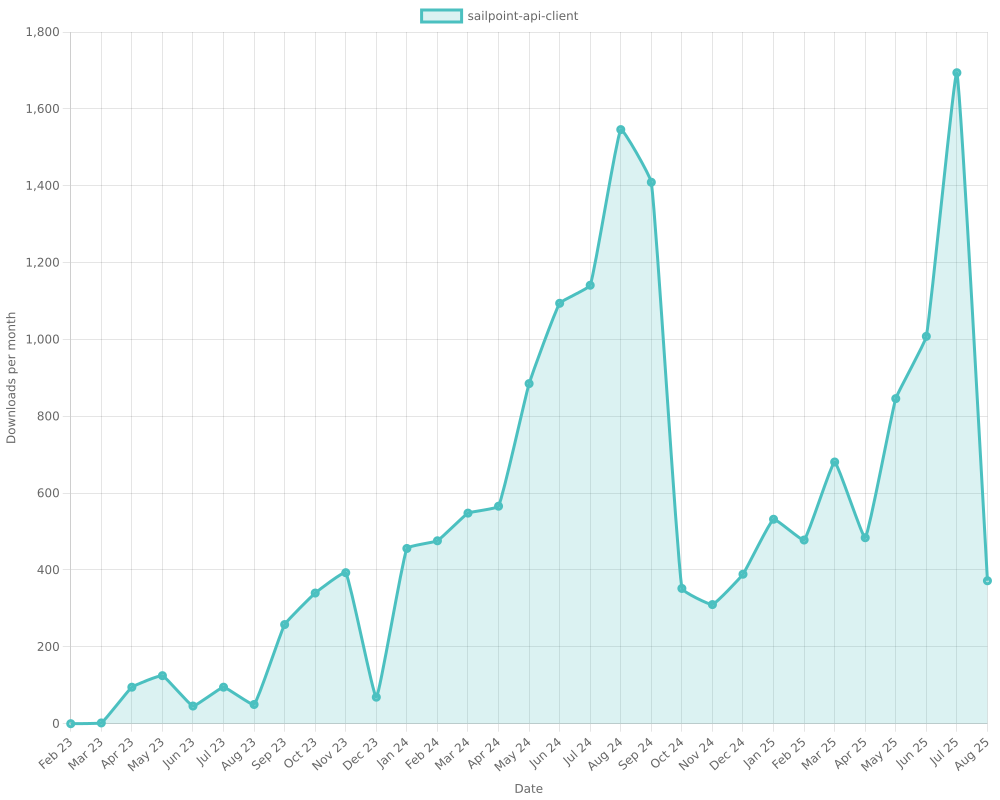
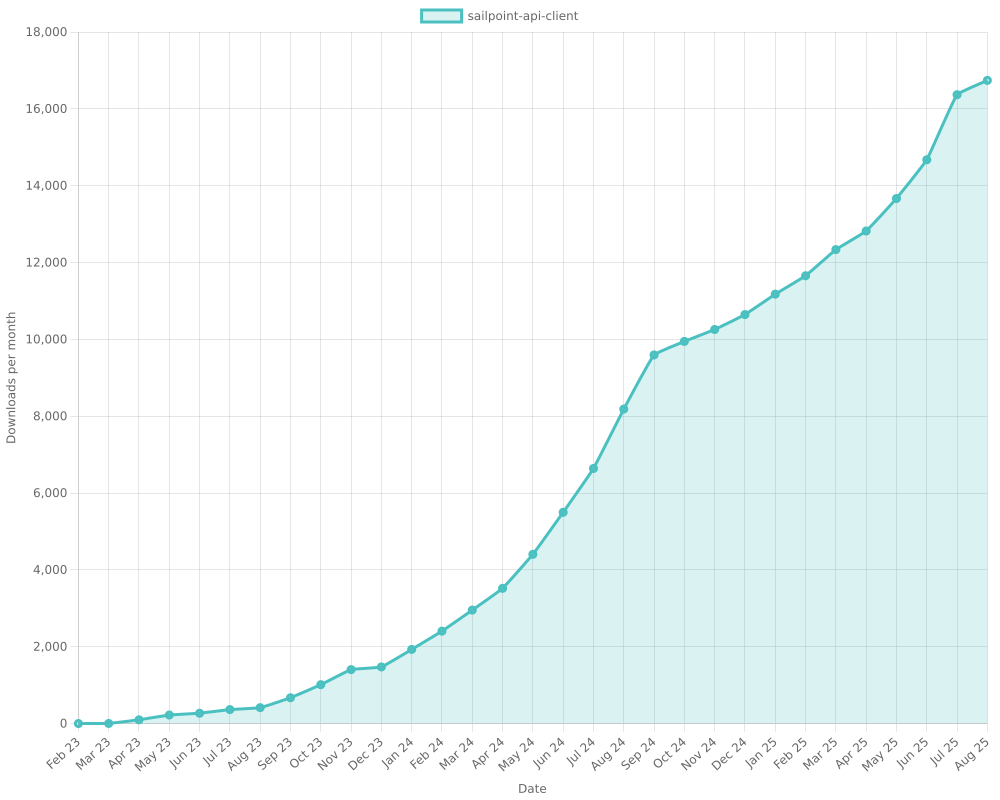
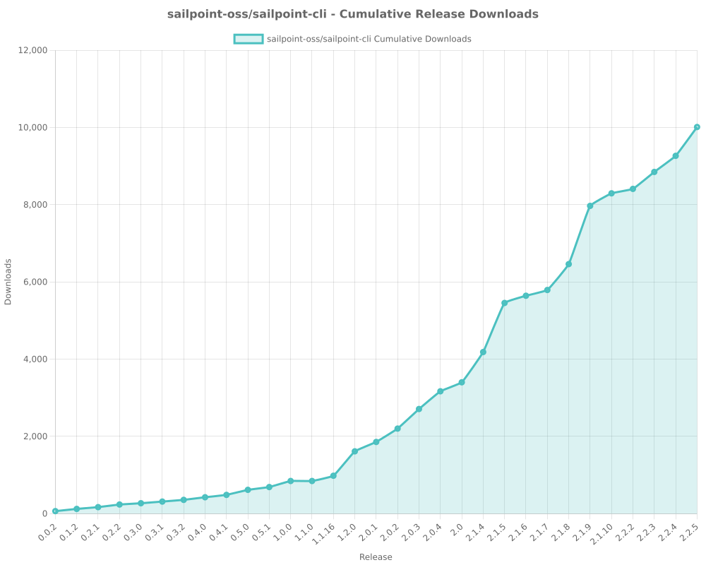
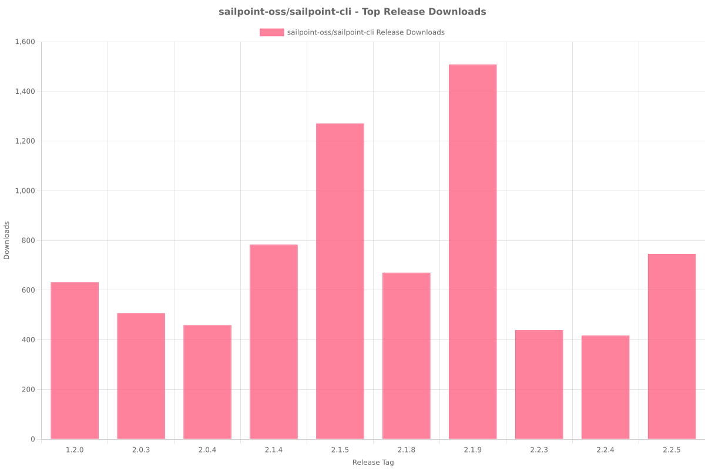
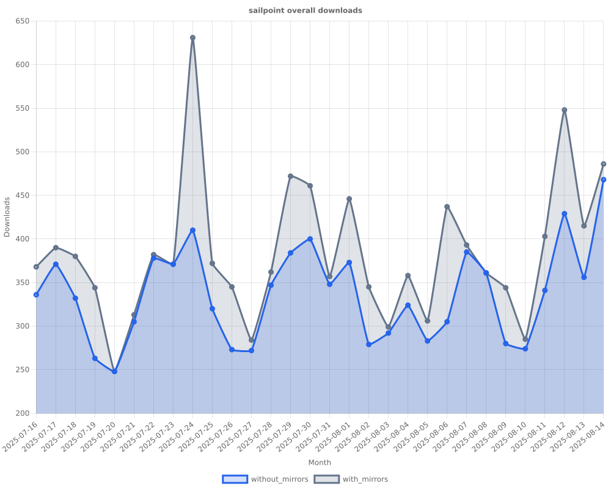
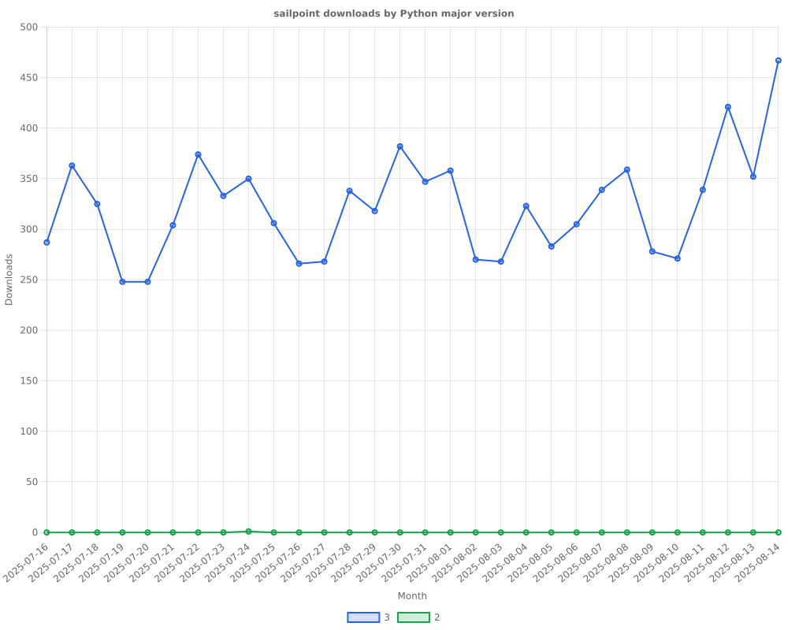
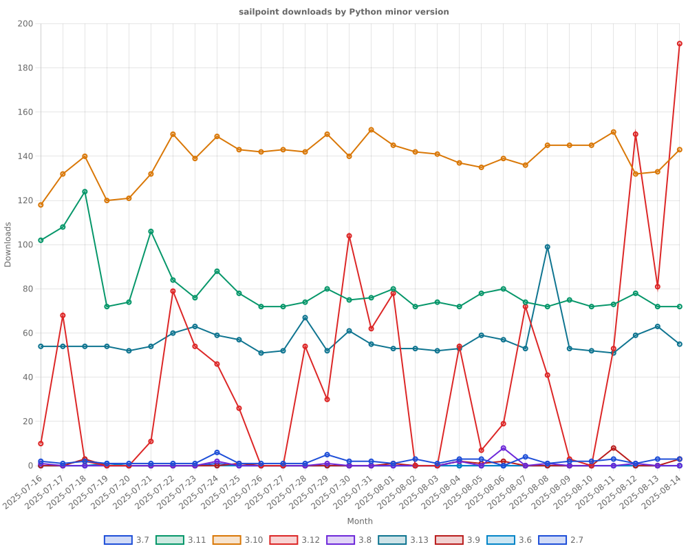
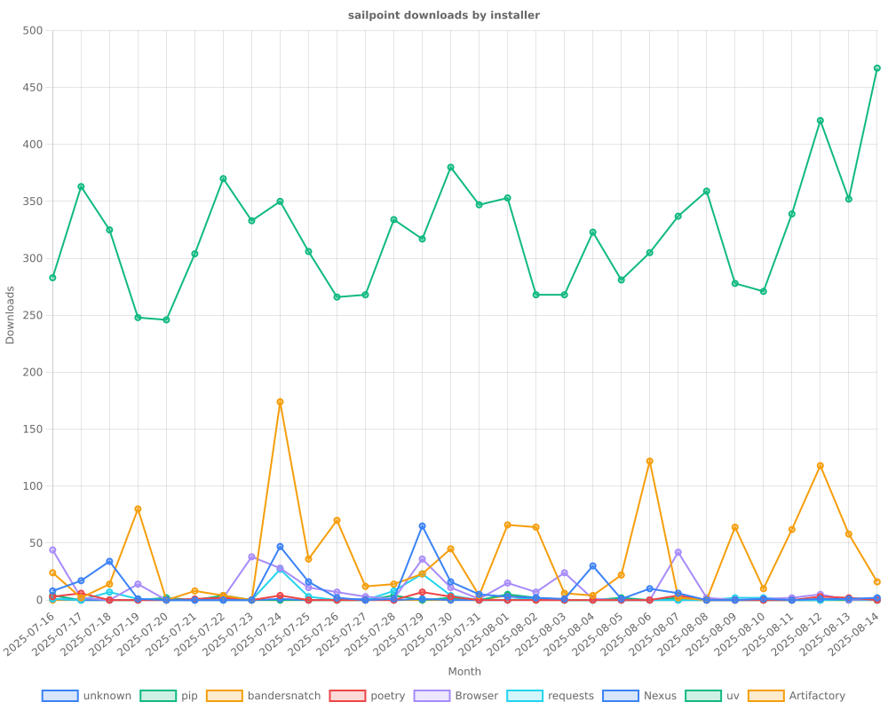
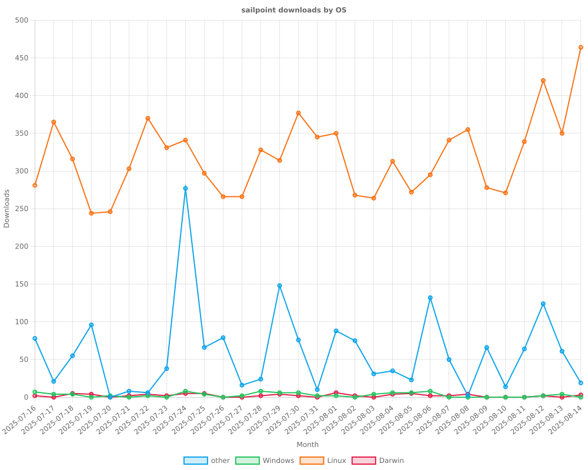
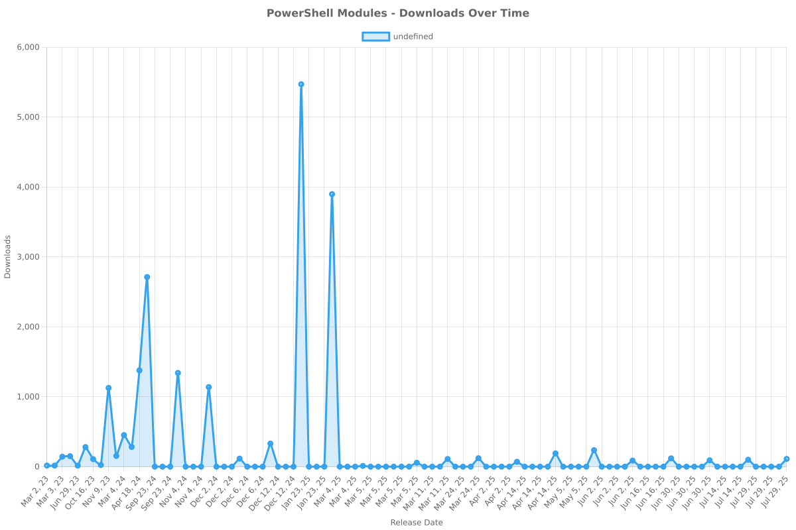

<!-- METRICS_START -->
# Usage Statistics
    
Last updated: 8/14/2025, 9:38:02 PM

Below are stats from artifacts tracked across NPM, GitHub, PyPI and PowerShell.
    
### NPM (JavaScript/TypeScript): 

| Package | Downloads | Monthly Downloads | Weekly Downloads | Daily Downloads |
| --- | --- | --- | --- | --- |
| sailpoint-api-client | 16,740 | 1,308 | 272 | 39 |
| **Total** | **16,740** | **1,308** | **272** | **39** | | | | |

### GitHub: 

| Repository | Stars | Forks | Watchers | Open Issues | Closed Issues | Total Issues | Release Downloads | Releases | Latest Release | Language |
| --- | --- | --- | --- | --- | --- | --- | --- | --- | --- | --- |
| sailpoint-oss/sailpoint-cli | 35 | 24 | 9 | 5 | 35 | 40 | 10,013 | 31 | 2.2.5 | Go |
| **Total** | **35** | **24** | **9** | **5** | **35** | **40** | **10,013** | **31** | | |

#### Repository Details:

**sailpoint-oss/sailpoint-cli**:
- Last Activity: 34 days ago
- Repository Age: 1,120 days
- Release Count: 31
- Total Release Downloads: 10,013
- Latest Release: 2.2.5
- Latest Release Downloads: 746
- Views: 484
- Unique Visitors: 160
- Clones: 18

### PyPI (Python): 

| Package | Total Downloads | Monthly Downloads | Weekly Downloads | Daily Downloads | Version |
| --- | --- | --- | --- | --- | --- |
| sailpoint | 21,614 | 10,108 | 2,894 | 468 | 1.3.8 |
| **Total** | **21,614** | **10,108** | **2,894** | **468** | | |

#### Package Details:

**sailpoint**:
- Version: 1.3.8
- Released: 2025-07-29
- Popular system: Linux
- Popular installer: pip
- Releases: 29
- OS Usage Breakdown 
  - other: 1782
  - Darwin: 67
  - Windows: 87
  - Linux: 9570
- Python Version Breakdown 
  - python2: 1
  - python3: 9690

### PowerShell: 

| Module | Total Downloads | Latest Version | Version Downloads | Versions | Last Updated |
| --- | --- | --- | --- | --- | --- |
| PSSailPoint | 20,447 | 1.6.6 | 111 | 32 | 8/14/2025 |
| PSSailpoint.V3 | 11,721 | 1.6.6 | 111 | 19 | 8/14/2025 |
| PSSailpoint.Beta | 12,049 | 1.6.6 | 110 | 19 | 8/14/2025 |
| PSSailpoint.V2024 | 11,716 | 1.6.6 | 106 | 19 | 8/14/2025 |
| PSSailpoint.V2025 | 1,009 | 1.6.6 | 102 | 8 | 8/14/2025 |
| **Total** | **56,942** | | | **97** | |

#### PowerShell Module Details:

**PSSailPoint**:
- Total Downloads: 20,447
- Latest Version: 1.6.6
- Latest Version Downloads: 111
- Version Count: 32
- Last Updated: 8/14/2025
- Package Size: 13618 KB

**PSSailpoint.V3**:
- Total Downloads: 11,721
- Latest Version: 1.6.6
- Latest Version Downloads: 111
- Version Count: 19
- Last Updated: 8/14/2025
- Package Size: 1023 KB

**PSSailpoint.Beta**:
- Total Downloads: 12,049
- Latest Version: 1.6.6
- Latest Version Downloads: 110
- Version Count: 19
- Last Updated: 8/14/2025
- Package Size: 1526 KB

**PSSailpoint.V2024**:
- Total Downloads: 11,716
- Latest Version: 1.6.6
- Latest Version Downloads: 106
- Version Count: 19
- Last Updated: 8/14/2025
- Package Size: 1881 KB

**PSSailpoint.V2025**:
- Total Downloads: 1,009
- Latest Version: 1.6.6
- Latest Version Downloads: 102
- Version Count: 8
- Last Updated: 8/14/2025
- Package Size: 1923 KB

<!-- METRICS_END -->